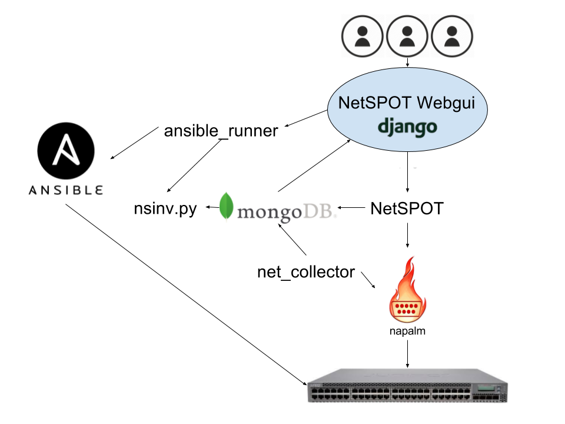

# Implementation overview

NetSPOT consists of a few different pieces. This document describes the different building blocks. A graphical representation can be seen below.

## Server

All of NetSPOT runs on w-v-netconf-0.

## Backend

### MongoDB

MongoDB is a NoSQL database that stores all information about all assets, groups and MAC addresses. It has no schema and is very easy to extend. Access to the data is through the NetSPOT library.

[https://www.mongodb.com/](https://www.mongodb.com/)

### NAPALM

In order to talk to and gather information about the different network elements NetSPOT uses NAPALM. This is a abstraction library to connect to network devices.

[https://github.com/napalm-automation](https://github.com/napalm-automation)

### NetSPOT library

NetSPOT backend consist of a python library that handles different operations. Adding new network devices, modifying, removing etc. It also handles other things like MAC addresses, groups and so on. All data collected by this library is stored in the MongoDB database.

The NetSPOT library uses a sublibrary called SpotMAX to handle the most basic function to interact with the MongoDB.

### net_collector

This Python script collects data from the assets every third hour. It queries all assets in the MongoDB database and update each assets information (MAC addresses, interfaces, JUNOS versions etc.) This runs from a cron job under the *automation* user on *w-v-netconf-0*.

## Frontend

The NetSPOT frontend consists of a Python website running on Django. It accesses the data from the MongoDB through the NetSPOT library. The frontend stores templates and Ansible playbook configuration in a SQLite database. The administration of this SQLite database is done by the Django Admin framworks (http://netspot/admin).

Users are authenticated to the MAX IV AD.

The frontend is what should be used for daily network tasks.

[https://www.djangoproject.com/](https://www.djangoproject.com/)

## Ansible

Ansible playbboks can be run via the frontend. Playbook file are stored in the NetSPOT repo. The configration for each playbook is stored in the SQLite database described above.

When the playbook runs it collects inventory data from the MongoDB through a Python script called nsinv.py.

[https://www.ansible.com/](https://www.ansible.com/)

## nsinv.py

This small Python script grabs data from the MongoDB and returns the data in JSON format readable by Ansible.

## Ansible runner

Anisble runner is a service running on *w-v-netconf-0*. It's purpose is to manage a job queue and schedule ansible jobs. When a user submits a job in the NetSPOT frontend ansible_runner will pick up the job from the queue and run the job.
